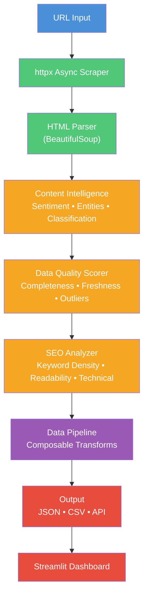

[](https://github.com/sponsors/ChunkyTortoise)

# Scrape-and-Serve

**Teams spend 5+ hours/week manually checking competitor prices, reformatting spreadsheets, and optimizing content for SEO.** Scrape-and-Serve consolidates all four into one Python toolkit.


[](https://ct-scrape-and-serve.streamlit.app)

**[Live Demo](https://ct-scrape-and-serve.streamlit.app)** -- try it without installing anything.

## Demo Snapshot


## What This Solves

- **Manual price tracking does not scale** -- YAML-configurable scrapers monitor competitor pages, detect changes via SHA-256 hashing, and alert when prices shift beyond thresholds
- **Excel files trap data in inboxes** -- Upload any .xlsx, auto-detect schema, generate a Streamlit CRUD app backed by SQLite
- **Content ships without SEO basics** -- SEO scoring engine grades content 0-100 across five dimensions with actionable fixes
- **No scheduled monitoring** -- Asyncio-based job scheduler with status tracking and callbacks

## Service Mapping

- **Service 9:** Automated Reporting Pipelines
- **Service 12:** Programmatic SEO Content Engine
- **Service 19:** Excel to Web App Modernization
- **Service 20:** Competitor Intelligence Web Scraping

## Certification Mapping

- Google Digital Marketing & E-commerce Certificate
- Meta Social Media Marketing Professional Certificate
- Google Data Analytics Certificate
- Microsoft AI-Enhanced Data Analysis

## Key Metrics

| Metric | Value |
|--------|-------|
| **Tests** | 302+ passing |
| **Scraping** | Async (httpx + asyncio) |
| **Content Intelligence** | Sentiment, entity extraction, classification |
| **Data Quality** | Multi-dimensional profiling and outlier detection |
| **SEO Analysis** | 5-dimension scoring with keyword density |
| **Data Pipeline** | Composable DataFrame transformations |
| **CI** | GitHub Actions (Python 3.11, 3.12) |

## Architecture



## Modules

| Module | File | Description |
|--------|------|-------------|
| **Web Scraper** | `scraper.py` | YAML-configurable scraping with CSS selectors and SHA-256 change detection |
| **Price Monitor** | `price_monitor.py` | Historical price tracking, configurable alert thresholds, CSV export |
| **Excel Converter** | `excel_converter.py` | .xlsx/.csv/.tsv to SQLite + auto-generated Streamlit CRUD app |
| **SEO Content** | `seo_content.py` | Content scoring 0-100, keyword density, readability, outline generation |
| **SEO Analyzer** | `seo_analyzer.py` | Advanced keyword suggestions, content comparison, technical SEO issues |
| **Diff Visualizer** | `diff_visualizer.py` | Page snapshot tracking, unified diffs, change history export |
| **Scheduler** | `scheduler.py` | Asyncio-based scheduled scraping with status tracking and callbacks |
| **Validator** | `validator.py` | Data validation rules: type checking, range, regex, custom rules |

## Quick Start

```bash
git clone https://github.com/ChunkyTortoise/scrape-and-serve.git
cd scrape-and-serve
pip install -r requirements.txt
make test
make demo
```

## Demo Data

| File | Contents | Use Case |
|------|----------|----------|
| `products.csv` | 15 products with prices and categories | Price monitoring, scraper output format |
| `inventory.xlsx` | 50-item inventory with SKU, pricing, stock | Excel converter demo, CRUD app generation |
| `scrape_config.yaml` | Sample YAML scraper configuration | Scraper target definition reference |

## Tech Stack

| Layer | Technology |
|-------|-----------|
| Scraping | BeautifulSoup4, httpx (async) |
| Data | Pandas, SQLite |
| UI | Streamlit, Plotly |
| Config | PyYAML |
| Testing | pytest (302 tests) |
| CI | GitHub Actions (Python 3.11, 3.12) |
| Linting | Ruff |

## Project Structure

```
scrape-and-serve/
├── app.py                          # Streamlit application entry point
├── scrape_and_serve/
│   ├── scraper.py                  # YAML-configurable web scraper + change detection
│   ├── price_monitor.py            # Price tracking, alerts, CSV export
│   ├── excel_converter.py          # .xlsx -> SQLite + Streamlit CRUD generation
│   ├── seo_content.py              # SEO scoring 0-100, outline generation
│   ├── seo_analyzer.py             # Keyword suggestions, content comparison
│   ├── diff_visualizer.py          # Page snapshot tracking + diff visualization
│   ├── scheduler.py                # Async scheduled scraping with callbacks
│   └── validator.py                # Data validation rules (type, range, regex)
├── demo_data/                      # Sample data for immediate exploration
├── tests/                          # 8 test files, one per module
├── .github/workflows/ci.yml        # CI pipeline
├── Makefile                        # demo, test, lint, setup
└── requirements.txt
```

## Architecture Decisions

| ADR | Title | Status |
|-----|-------|--------|
| [ADR-0001](docs/adr/0001-httpx-async-over-requests.md) | httpx Async Over requests | Accepted |
| [ADR-0002](docs/adr/0002-content-intelligence-pipeline.md) | Content Intelligence Pipeline | Accepted |
| [ADR-0003](docs/adr/0003-data-quality-validation.md) | Data Quality Validation | Accepted |

## Testing

```bash
make test                                   # Full suite (136 tests)
python -m pytest tests/ -v                  # Verbose output
python -m pytest tests/test_scraper.py      # Single module
```

## Benchmarks

See [BENCHMARKS.md](BENCHMARKS.md) for detailed performance data.

## Changelog

See [CHANGELOG.md](CHANGELOG.md) for release history.

## Related Projects

- [EnterpriseHub](https://github.com/ChunkyTortoise/EnterpriseHub) -- Real estate AI platform with BI dashboards and CRM integration
- [insight-engine](https://github.com/ChunkyTortoise/insight-engine) -- Upload CSV/Excel, get instant dashboards, predictive models, and reports
- [docqa-engine](https://github.com/ChunkyTortoise/docqa-engine) -- RAG document Q&A with hybrid retrieval and prompt engineering lab
- [ai-orchestrator](https://github.com/ChunkyTortoise/ai-orchestrator) -- AgentForge: unified async LLM interface (Claude, Gemini, OpenAI, Perplexity)
- [prompt-engineering-lab](https://github.com/ChunkyTortoise/prompt-engineering-lab) -- 8 prompt patterns, A/B testing, TF-IDF evaluation
- [llm-integration-starter](https://github.com/ChunkyTortoise/llm-integration-starter) -- Production LLM patterns: completion, streaming, function calling, RAG, hardening
- [Portfolio](https://chunkytortoise.github.io) -- Project showcase and services

## Deploy

[](https://share.streamlit.io/chunkytortoise/scrape-and-serve/main/app.py)

## License

MIT -- see [LICENSE](LICENSE) for details.
